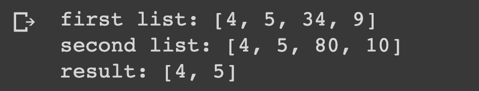

# Find Common Elements in Lists

## Description

Define two lists and print a new list with the common elements.

## Expected output

## Helpuf resources

## How to submit my solution?

Add your solution to your README file

## More Help?

Slack us 😉

# Solution

## PLEASE DON'T CHECK THE SOLUTION UNTIL YOU HAVE FINISH YOURS

### Take in mind that this is an example solution, your implementation can be different and that's ok

[Solution](../sol)
