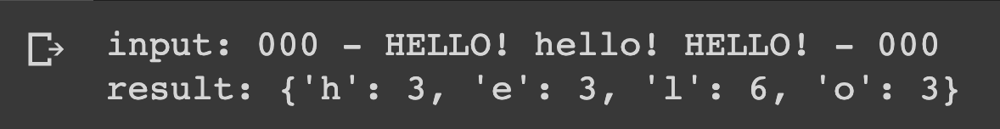

# Counting occurrences of letters in a string

## Description

Define a string and print a dictionary containing the count of each letter (case-insensitive) in the string, ignore all characters that aren't letters.

## Expected output

## Helpful Resources

1. [Case-insensitive](https://techterms.com/definition/case-insensitive)
2. [Check if a char is letter](https://www.entechin.com/python-check-if-character-is-letter-in-string/)

## How to submit my solution?

Add your solution to your README file

## More Help?

Slack us 😉

# Solution

## PLEASE DON'T CHECK THE SOLUTION UNTIL YOU HAVE FINISH YOURS

### Take in mind that this is an example solution, your implementation can be different and that's ok

[Solution](../sol)
