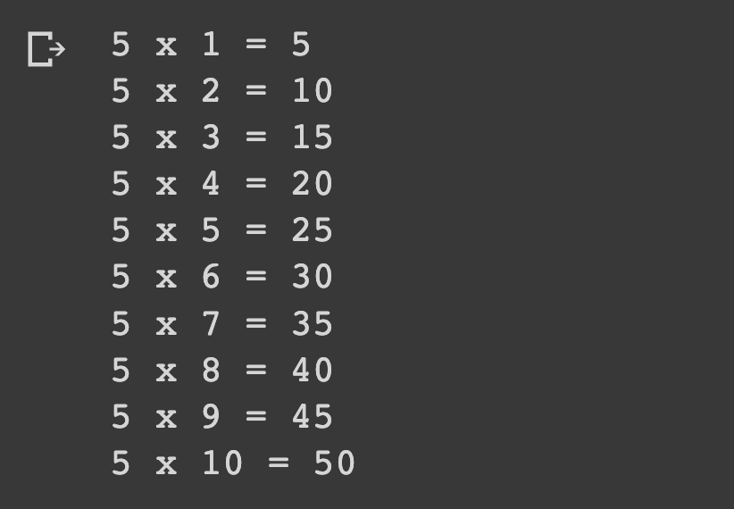

# Printing Multiplication Tables

## Description

Write a Python program that takes an integer and prints the multiplication table for that number up to 10.

## Expected output

## Helpful Resources

1. [Python while](https://www.w3schools.com/python/python_while_loops.asp)

## How to submit my solution?

Add your solution to your README file

## More Help?

Slack us 😉

# Solution

## PLEASE DON'T CHECK THE SOLUTION UNTIL YOU HAVE FINISH YOURS

### Take in mind that this is an example solution, your implementation can be different and that's ok

[Solution](../sol)
