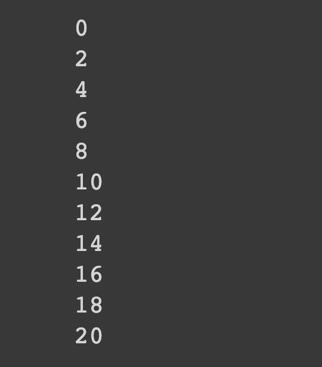

# Printing Even Numbers Using a While Loop

## Description
Write a Python program that uses a while loop to print out all the even numbers between 0 and 20, inclusive.

## Expected output

## Helpful Resources

## How to submit my solution?

Add your solution to your README file

## More Help?

Slack us 😉

# Solution

## PLEASE DON'T CHECK THE SOLUTION UNTIL YOU HAVE FINISH YOURS

### Take in mind that this is an example solution, your implementation can be different and that's ok

[Solution](../sol)
