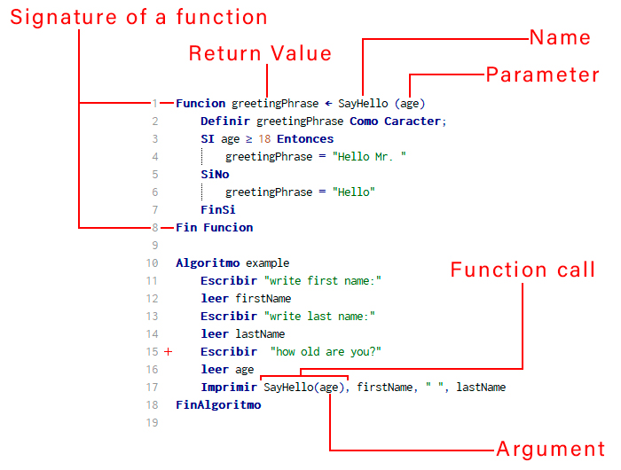

# Structure of a function

## Description

The predefined functions of pseint, are codes already integrated in the program to be used when the user requires it, normally they are mathematical functions or functions for text strings.

```
  - Structure of a function
    - Signature of a function
    - Name
    - Arguments, Parameters
    - Return Values
    - Function call
```



### Signature of a function

The signature of a method or function defines its input and output. Include at least the name of the function or method and the number of its parameters. In some programming languages, you can include the type that the function returns or the type of its parameters.

### Name

The name of a function allows us to separate it from the rest and locate it to be able to use it when necessary.

### Arguments, Parameters

In the definition of a function the values ​​that are received are called parameters, but during the call the values ​​that are sent are called arguments.

### Return Values

When a function returns a value, the call to the function is simply replaced by that returned value.

### Function call

Normally the call to a function will be made from the main function main(), although naturally it can also be from another function.

## Example code

```python
Funcion greetingPhrase <- SayHello (age)
	Definir greetingPhrase Como Caracter;
	SI age >= 18 Entonces
		greetingPhrase = "Hello Mr. "
	SiNo
		greetingPhrase = "Hello"
	FinSi
Fin Funcion

Algoritmo example
	Escribir "write first name:"
	leer firstName
	Escribir "write last name:"
	leer lastName
	Escribir  "how old are you?"
	leer age
	Imprimir SayHello(age), firstName, " ", lastName
FinAlgoritmo
```
