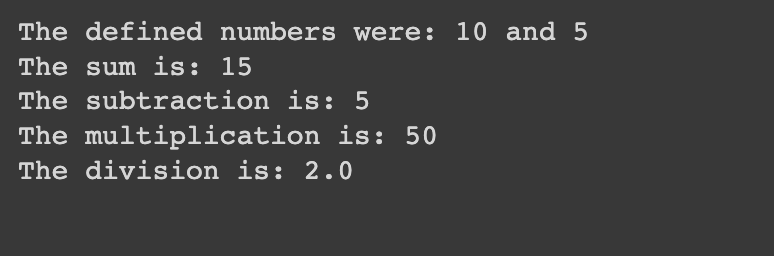

#  Arithmetic Operations

## Description

Defines two variables and performs basic arithmetic operations (add, subtract, multiply, and divide) and print the results.

## Expected output

## Helpuf resources

- [Python operators (arithmetic section)](https://www.w3schools.com/python/python_operators.asp)

## How to submit my solution?

Add your solution to your README file

## More Help?

Slack us 😉

# Solution

## PLEASE DON'T CHECK THE SOLUTION UNTIL YOU HAVE FINISH YOURS

### Take in mind that this is an example solution, your implementation can be different and that's ok

[Solution](../sol)
