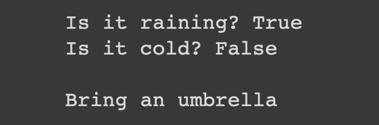

#  Weather suggestion

## Description

define two variables that indicates if it's raining or it's cold and if it’s raining and it’s cold suggest to bring a coat and an umbrella, if just it’s raining suggest to bring an umbrella, if just it’s cold suggest to brig a coat and if it isn’t raining and it isn’t cold suggest not to bring anything. Play with the possible options.

## Expected output

## Helpuf resources

- [Python operators (arithmetic section)](https://www.w3schools.com/python/python_operators.asp)
- [Python booleans](https://www.w3schools.com/python/python_booleans.asp)

## How to submit my solution?

Add your solution to your README file

## More Help?

Slack us 😉

# Solution

## PLEASE DON'T CHECK THE SOLUTION UNTIL YOU HAVE FINISH YOURS

### Take in mind that this is an example solution, your implementation can be different and that's ok

[Solution](../sol)
