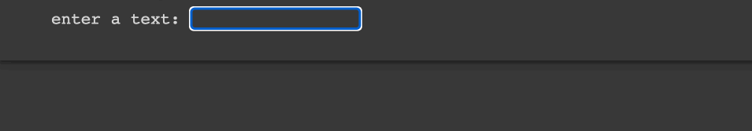

# String index

## Description

Write a Python program that prompts the user for a string and then prints the first and last characters of the string. The program should print a message that says `"The first character is [first] and the last character is [last]."` where [first] is the first character of the string and [last] is the last character of the string.

## Expected output

## Helpuf resources

- [Python format](https://www.w3schools.com/python/ref_string_format.asp)

## How to submit my solution?

Add your solution to your README file

## More Help?

Slack us 😉

# Solution

## PLEASE DON'T CHECK THE SOLUTION UNTIL YOU HAVE FINISH YOURS

### Take in mind that this is an example solution, your implementation can be different and that's ok

[Solution](../sol)
