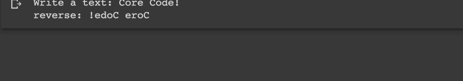

# Reverse

## Description

Wirte a program that reverse a string based on a user input.

## Expected output

## Helpuf resources

- [Python string slicing](https://realpython.com/lessons/string-slicing/)

## How to submit my solution?

Add your solution to your README file

## More Help?

Slack us 😉

# Solution

## PLEASE DON'T CHECK THE SOLUTION UNTIL YOU HAVE FINISH YOURS

### Take in mind that this is an example solution, your implementation can be different and that's ok

[Solution](../sol)
