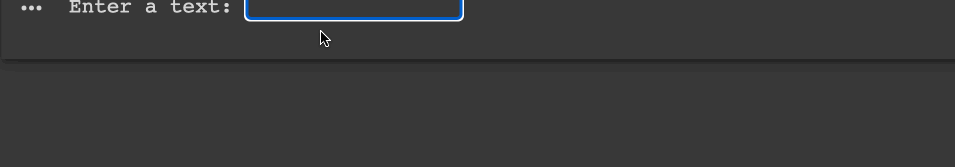

# Space replacing

## Description

Write a program that replace the spaces with asterisks. Like this: `Hey! We are in Core Code.` -> `Hey!*We*are*in*Core*Code.` based on the user input.

## Expected output

## Helpuf resources

- [Python string slicing](https://realpython.com/lessons/string-slicing/)

## How to submit my solution?

Add your solution to your README file

## More Help?

Slack us 😉

# Solution

## PLEASE DON'T CHECK THE SOLUTION UNTIL YOU HAVE FINISH YOURS

### Take in mind that this is an example solution, your implementation can be different and that's ok

[Solution](../sol)
