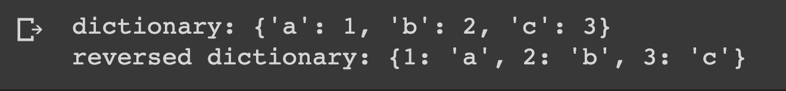

# Reverse Dictionary

## Description

Define a dictionary and print a new dictionary with the keys and values swapped.

## Expected output

## Helpuf resources
[Loop dictionary](https://www.geeksforgeeks.org/iterate-over-a-dictionary-in-python/)
[Inline dictionary loop](https://betterprogramming.pub/4-ways-to-write-one-liner-for-loops-in-python-e8c1db903ce2)

## How to submit my solution?

Add your solution to your README file

## More Help?

Slack us 😉

# Solution

## PLEASE DON'T CHECK THE SOLUTION UNTIL YOU HAVE FINISH YOURS

### Take in mind that this is an example solution, your implementation can be different and that's ok

[Solution](../sol)
