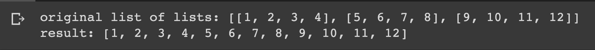

# Flattening a List of Lists

## Description

Define a list of lists and print a new list containing all the elements from all the sublists

## Expected output

## Helpful Resources

1. [Python list methods](https://www.w3schools.com/python/python_ref_list.asp)

## How to submit my solution?

Add your solution to your README file

## More Help?

Slack us 😉

# Solution

## PLEASE DON'T CHECK THE SOLUTION UNTIL YOU HAVE FINISH YOURS

### Take in mind that this is an example solution, your implementation can be different and that's ok

[Solution](../sol)
