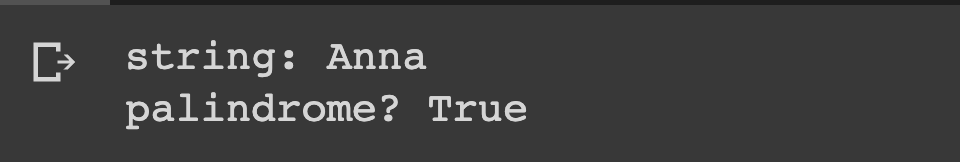

# Checking for Palindromes

## Description

Write a Python program that takes a string and print True if the string is a palindrome (reads the same backward as forward), and False otherwise.

## Expected output

## Helpful Resources

1. [Palindorme](https://examples.yourdictionary.com/palindrome-examples.html)

## How to submit my solution?

Add your solution to your README file

## More Help?

Slack us 😉

# Solution

## PLEASE DON'T CHECK THE SOLUTION UNTIL YOU HAVE FINISH YOURS

### Take in mind that this is an example solution, your implementation can be different and that's ok

[Solution](../sol)
