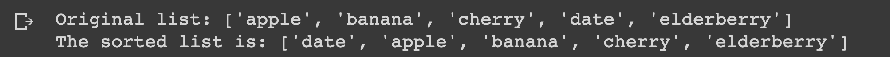

# Sorting a List of Strings by Length

## Description

Write a Python function that takes a list of strings as an argument and returns a new list of strings sorted by length. Use a lambda function to specify the sorting key.

## Expected output

## Helpful Resources

1. [Python functions](https://www.w3schools.com/python/python_functions.asp)
2. [Python lambda](https://www.w3schools.com/python/python_lambda.asp)

## How to submit my solution?

Add your solution to your README file

## More Help?

Slack us 😉

# Solution

## PLEASE DON'T CHECK THE SOLUTION UNTIL YOU HAVE FINISH YOURS

### Take in mind that this is an example solution, your implementation can be different and that's ok

[Solution](../sol)
