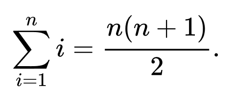

# Code complexity

## Solution 😎

**Option 1:**
```python
# Using a loop to compute the sum
n = 10
sum = 0
for i in range(1, n+1):
    sum += i
print(sum)
```
This code fragment uses a loop to compute the sum of the first n natural numbers, where n is set to 10 in this example. The time complexity of this code is `O(n)`, where n is the value of `n`. This is because the code must iterate through the `for` loop n times, adding each number to the running total.

**Option 2:**

Summation formula:


```python
# Using the closed-form formula to compute the sum
n = 10
sum = n*(n+1)/2
print(sum)

```
This code fragment uses the closed-form formula for computing the sum of the first n natural numbers. The time complexity of this code is `O(1)`, which means that it takes a constant amount of time to execute, regardless of the size of the input. This is because the formula does not involve any loops or iterations, and only a few basic arithmetic operations are required to compute the sum.

**Conclusion**
In general, if you only need to compute the sum of the first n natural numbers, the closed-form formula is more efficient than using a loop. However, if you need to perform more complex calculations or computations that cannot be expressed using a simple formula, then using a loop or other iterative approach may be necessary.

## Video Solution 📹

[Code complexity](https://drive.google.com/file/d/1MfVS6h0oQLhAeUEbf3H0p58i4BEH9C1t/view?usp=share_link)
<iframe width="560" height="315" src="https://www.youtube.com/embed/H8WN9dBiTpo" title="YouTube video player" frameborder="0" allow="accelerometer; autoplay; clipboard-write; encrypted-media; gyroscope; picture-in-picture; web-share" allowfullscreen></iframe>
