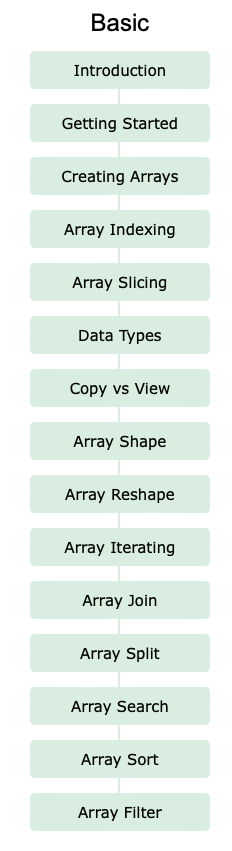

# NumPy Documentation

## Description

Read the following tutorial in the 'Basic' category. You will see that some of the content has been covered during the Learning Session. You will have to read what you don't know yet in order to complete the exericises you will find across the differente chapters of this module. 

[Tutorial/Documentation](https://www.w3schools.com/python/numpy/default.asp)

You can also access the whole list of exercises here:

[List of Exercises](https://www.w3schools.com/python/numpy/exercise.asp)

You can also work on the exercises while looking for the answers in the documentation, that is fine as well.

## Expected output

Completing the Basic section of the Python Numpy Documentation/Tutorial, you will have to take a screenshot of the 23 exercises completed.

## How to submit my solution?

Put a screenshot of your 23 exercises completed in your readme.

## More Help?

Slack us 😉

# Solution

## PLEASE DON'T CHECK THE SOLUTION UNTIL YOU HAVE FINISH YOURS

### Take in mind that this is an example solution, your implementation can be different and that's ok

[Solution](../sol)
