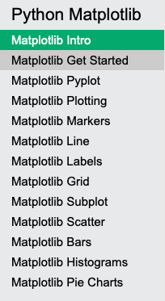
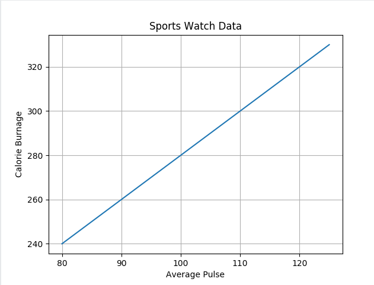

# MatplotLib Documentation

## Description

Read the following Matplotlip tutorial, most of the content have been covered in the Learning Session. 

[MatplotLib](https://www.w3schools.com/python/matplotlib_intro.asp)

For this challenge you will have to create your very own chart with any data you like. You may use NumPy arrays, regular Python arrays, random samples, etc, any data you'd like. Feel free to get as creative as you want! 

## Expected output

Take a screenshot of your chart, write a little explanation about the source of the date and what the chart means to you. Put labels on the axis

## How to submit my solution?

Put a screenshot of your chart.

## More Help?

Slack us 😉

# Solution

## PLEASE DON'T CHECK THE SOLUTION UNTIL YOU HAVE FINISH YOURS

### Take in mind that this is an example solution, your implementation can be different and that's ok

[Solution](../sol)
