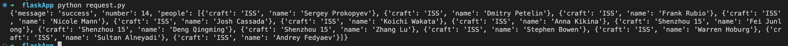

# Calling and API using Python 🐍

## Description

Using the 'requests' python library, call an API and print the reponse in JSON format. 

You can literally call any API you want, for reference, you can pick one from the following list

[Free API's](https://apipheny.io/free-api/)

## Expected output

Code with the correct instruction to call an API using a Python library

## How to submit my solution?

Add your solution to your README file

## More Help?

Slack us 😉

# Solution

## PLEASE DON'T CHECK THE SOLUTION UNTIL YOU HAVE FINISH YOURS

### Take in mind that this is an example solution, your implementation can be different and that's ok

[Solution](../sol)

